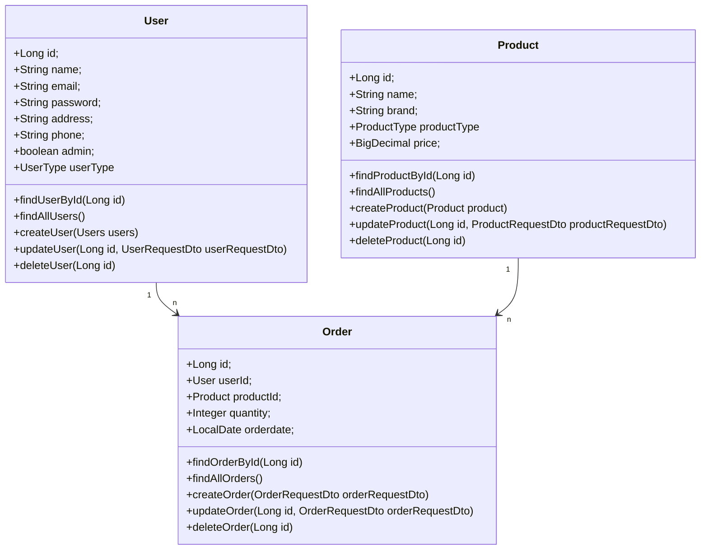

***API DISTRIBUIDORA***

**Função:**
- Facilitar o gerenciamento dos Clientes e Fornecedores de uma Distribuidora

**Diagrama de classes:**

```mermaid
classDiagram   
    class Order {
        +Long id;
        +User userId;
        +Product productId;
        +Integer quantity;
        +LocalDate orderdate;
        
        +findOrderById(Long id)
        +findAllOrders()
        +createOrder(OrderRequestDto orderRequestDto)
        +updateOrder(Long id, OrderRequestDto orderRequestDto)
        +deleteOrder(Long id)
    }
    
    class Product {
        +Long id;
        +String name;
        +String brand;
        +ProductType productType
        +BigDecimal price;
        
        +findProductById(Long id)
        +findAllProducts()
        +createProduct(Product product)
        +updateProduct(Long id, ProductRequestDto productRequestDto)
        +deleteProduct(Long id)
    }
    
        class User {
        +Long id;
        +String name;
        +String email;
        +String password;
        +String address;
        +String phone;
        +boolean admin;
        +UserType userType
        
        +findUserById(Long id)
        +findAllUsers()
        +createUser(Users users)
        +updateUser(Long id, UserRequestDto userRequestDto)
        +deleteUser(Long id)
    }

    User "1" --> "n" Order
    Product "1" --> "n" Order
```
