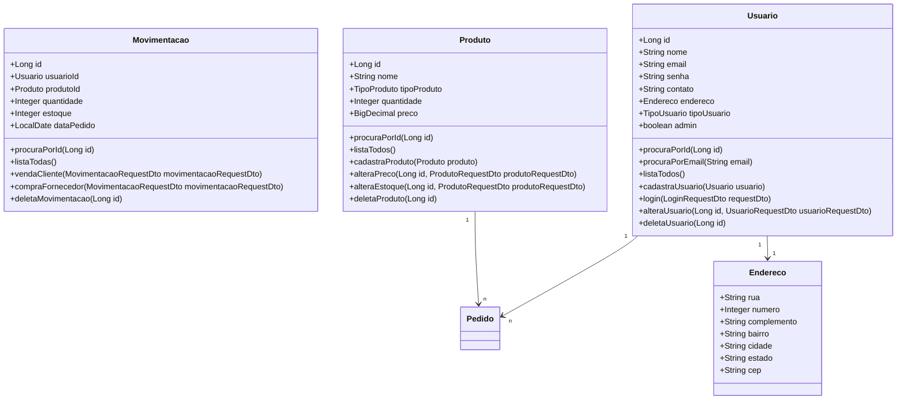

# API Distribuidora

Esta é a API para a aplicação Distribuidora, desenvolvida em Java com Spring Boot.

## Tecnologias Utilizadas

- Java
- Spring Boot
- Maven
- H2 Database

## Configuração do Ambiente

1. **Clone o repositório:**
```bash
git clone https://github.com/DiegoCasemiroFS/distribuidora.git
```

## Documentação

```bash
http://localhost:8080/v3/api-docs
```

```bash
http://localhost:8080/swagger-ui/index.html
```

## Diagrama de classes:


