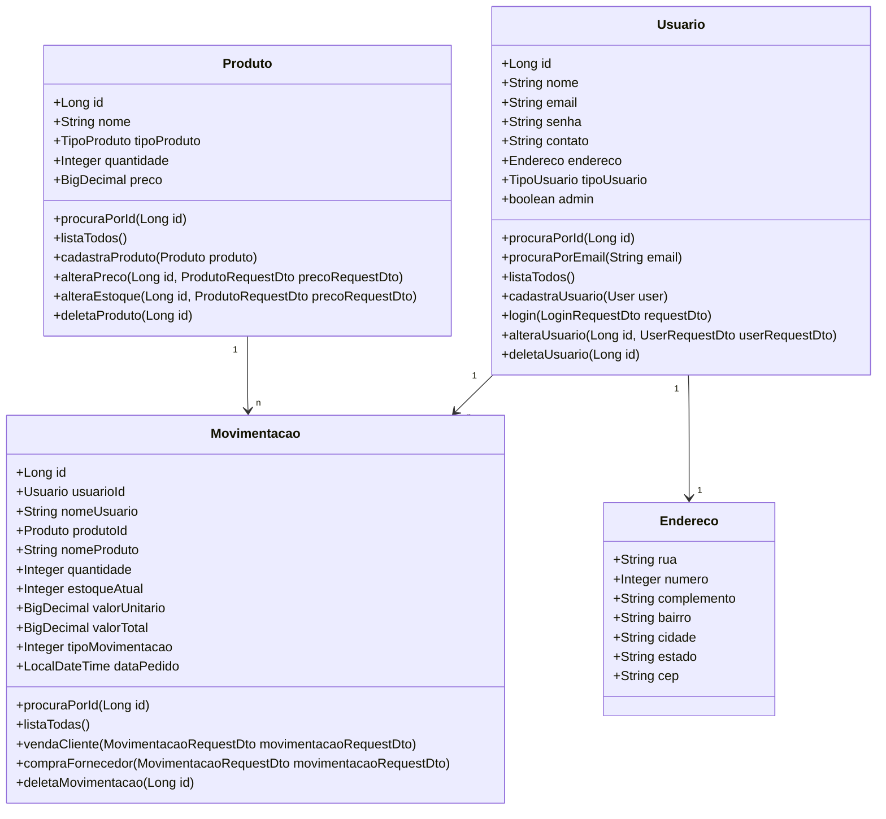

# API Distribuidora

API de gestão de Vendas, Produtos e Usuários de uma distribuidora.

## Tecnologias Utilizadas

- Java
- Spring Boot
- Maven
- PostgreSQL

## Configuração do Ambiente

1. **Clone o repositório:**
```bash
git clone https://github.com/DiegoCasemiroFS/distribuidora.git
```

## Diagrama de classes:


